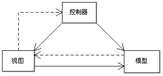
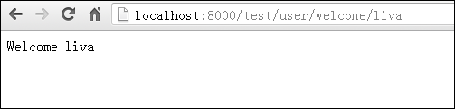

mnjs
====

## 1 简介
MNJS是基于Mongodb和Nodejs 开发数据库驱动的完整Web框架，完全采用Javascript语言。MNJS是由Mongodb、Nodejs和JavaScript三个单词中大写字母组合而成，其中mongodb是一个基于类似json的bjson格式可扩展的高性能的No SQL开源分布式数据库，nodejs是用于构建的可扩展的高性能的事件驱动、非阻塞I/O的网络应用程序的Javascript开发平台。
MNJS框架的主要功能如下：
- 数据库、服务器和客户端全部基于Javascript；
- 完全基于NoSQL数据库，存储容量与存储结构易扩展；
- 完全基于事件驱动、非阻塞I/O、异步响应模型；
- 支持有状态（stateful）与无状态(stateless)两种服务；
- 优美的Restful架构；
- 基于Model、View、Controller(MVC)的架构模型；
- 视图提供服务器端和客户端两种可选的渲染模型；
- 提供大数据的分页功能；
- 支持多文件上传功能,文件可以存放在文件系统或数据库中；
- 数据库和服务器均支持集群方式；
- 遵循Convention over Configuration(CoC)原则，零配置；
- 静态服务器与动态服务器容为一体；
- 热点代码自动重载，方便开发与调试；
- 提供静态资源和模板文件的缓存功能；
- 提供单进程和多进程两种运行模式；
- 集成原生应用和Web应用开发的Web IDE。

## 2 安装
### 2.1 安装环境
安装系统所环境如下：
- 操  作 系 统：Windows、Linux、Unix；
- 数据库服务器：Mongodb 2.0.8；
- Web服务器平台：Nodejs 0.8.18 或 更新版本；
- 客户环境要求： FireFox 、MS IE 、Google Chrome、Apple Safra；
### 2.2 安装说明
以Windows xp操作系统为例，安装说明如下：
1).将mnjs.zip包用Winrar或7z解压缩软件可以解压到任意位置，本框架全部采用相对路径，本例直接解到D盘。
2).启动mongodb数据库：用资源管理器打开D:\mnjs\mongodbserver, 然后双击run.bat启动数据库,数据库启动成功界面如图1所示。

   
图1 Mongodb 数据库 

3).静态配置MNJS框架：相关配置信息在D:\mnjs\config.js文件中，具体如下：

```javascript {.line-numbers}
 ///////////////////////配置选项////////////////////////////////////
 // 服务器监听端口
 config.PORT = 8000;
 
 // 调试信息开关,开发过程建议设置为true,生产过程建议设置为false
 config.debug = false;
 // 模板视图客户端或服务端渲染开关:服务器为true,客户端为flase
 config.temp = false;
 // 有状态或无状态开关,即有状态开启Session会话true，无状态则不开启false
 config.status = false;
 // Web服务器是否多核CPU运行
 config.multi = false;
 
 // 设置应用中只有statics和upload目录用户可读静态目录
 config.getReadDir = function() {
 	return /\/(upload|statics)\//i;
 };
 
 // 会话失效时间(默认1天时间)毫秒
 config.sessionExpiredTime = 3000;
 
 // 设置默认的['application', 'controller', 'action']
 config.def = ['test', 'user', 'list'];
 
 // 指定后缀文件和过期日期
 config.expiresFile = {
     fileMatch: /gif|png|jpg|js|css/ig,
     maxAge: 60*60*24*365
 };
 
 // 配置压缩的列表
 config.compressFile = {
     match: /css|js|html/ig
 };
 
 // 缓存CACHE大小设置，单位为字节，主要缓存静态资源和模板文件
 config.cacheSize = {
         MaxSingleSize: 1024*1024,	//单个文件最大尺寸
         MaxTotalSize: 30*1024*1024 //整个文件Cache最大尺寸
 };
```
4).启动web服务器：在开始菜单上点击“运行”菜单，打开运行对话框，输入cmd，点击确定打开命令行黑窗口，输入D:，将盘符改D盘，再输入cm mnjs，进入mnjs目录。输入node server.js回车即可启动服务器，服务器启动成功如图2所示。

  
图2 web服务器启动界面 

5).动态配置MNJS框架，使用方法如下：
Node server.js [options]
其中options为可选项，若options省略，则全部采用静态配置，否则采用动态配置。该框架提供5个动态配置选项如下：
Port选项： 用于设置服务器监听端口；
Debug选项：用于设置服务器运行状态为开发环境还是生产环境，如果是开发环境，可以显示详细运行过程信息，具有热点代码重载功能，但不打开缓存功能；如果运行态为生产环境，则不显示详细运行过程信息，打开缓存功能，但无热点代码重载功能；
Temp选项：用于设置HTML模板是在服务器端渲染还是客户端渲染，建议采用客户端渲染方式可以降低服务器压力；
Status选项：设置服务状态为有状态还是无状态，如果采用集群模式，建议选用无状态模式；
Multi选项：用于设置服务器是单进程运行还是多进程运行，如果是多核CPU或 多CPU则建议开启multi选项。
6).测试安装：打开浏览器，输入http://localhost:8000/test/user/list地址，如果出现如图3所示界面，则表示mongodb数据库、web服务器、MNJS框架安装配置成功。

  
图3 测试页面 

### 2.3 集成开发环境
本框架提供一个基于Web的集成开发环境MNJS IDE，可以在浏览器中进行Web应用程序和原生应用程序的开发工作。本IDE主要提供了工程管理器和开发环境两个主要功能。访问地址为http://localhost:8000/ide/mnjs/projects。工程管理器主要管理多个Web应用程序如图4所示，可以新建工程、删除工程和编辑工程。新建工程时可以选择工程类型如图5所示。

  
图4 工程管理器  

  
图5 新建工程  

开发环境主要工程开发编辑功能如图6所示，可以管理工程中的目录和文件，且可以多文件同时编写Web应用程序。
  
图6 开发环境

## 3 MVC框架
MVC模式（三层架构模式）（Model-View-Controller）是软件工程中的一种软件架构模式，把软件系统分为三个基本部分：模型（Model）、视图（View）和控制器（Controller）。如图7所示。

  
图7 MVC模型  

1).Controller：负责转发请求，对请求进行处理。
2).View：界面设计人员进行图形界面设计。
3).Model：程序员编写程序应有的功能（实现算法等等）、数据库专家进行数据管理和数据库设计(可以实现具体的功能)。

### 3.1 框架介绍
MVC框架为模型Model、视图View、控制器Controller的一种流行的软件架构。
框架根目录如图8示，下面进行详细说明：
1）docs目录为相关文档和教材目录；
2）Mongodbserver目录为mongodb数据库；
3）Nginx目录为nginx代理服务器；
4）Node_modules目录为框架模块，例如mongodb数据库驱动模块node-mongodb-drvier；
5）Src目录为nodejs,mongodb,nginx的工程源码；
6）Webapps目录为web应用程序的根目录；
7）Apps目录为原生应用程序的根目录；
8）Ab.exe文件为apache提供的web压力测试工具；
9）Node.exe文件为nodejs运行环境；
10）Config.js文件为框架的配置文件；
11）Mnjs.js文件为框架文件；
12）Server.js文件为服务器文件；
Service.js文件为服务器伺服文件。

  
图8 框架根目录  

根据Convention over Configuration(CoC)原则，Web应用程序目录结构基本约定俗成如图9示，下面具体说明：
1) Controllers目录：Web应用程序的控制器目录；
2) Models目录：Web应用程序的模型所在目录；
3) Views 目录：Web应用程序的视图所在目录；
4) Statics目录：Web应用程序中静态资源目录，也为静态Web服务器的根目录；
5) Upload目录：Web应用程序上传根目录；
6) Config.js文件：Web应用程序的配置文件。
本框架的每个Web应用程序结构按如上结构组织。

  
图9  Web应用程序目录  

### 3.2 控制器Controller
MNJS框架控制器根据用户请求的URL，解析URL，定位URL对应的资源（静态服务器）或者方法（动态服务器），再将处理结果返回给用户。
#### 3.2.1 Restful URL
本框架的URL设计非常优美，分为静态URL和动态URL，分别对应静态服务器和动态服务器。
该框架动态URL由Web协议、域名、应用程序名称、控制器名称、动作名称、n个参数(n>=0)构成，如图10示。Web协议可以是HTTP或HTTPS两种协议中任意一种；如果服务器的端口不为80时，则在域名后面加上:端口；应用程序名称为框架中Web应用程序根目录中每个文件夹的名称；控制器的名称为每个Web应用程序目录下Controllers目录里每个js文件名，不带扩展名；动作为控制器中定义的公有函数名称；URL中可以带多个参数，参数与参数之间用/分隔，不再采用传统键值对用?和&分隔的方法，使得URL更美观。一个域名可以对应多个应用也即一个Web服务器可以运行多个Web应用程序，每个Web应用程序由多个控制器构成，而控制器又由多种动作构成。
  
图10 动态 URL组成部分  

该框架静态URL由Web协议、域名、应用程序名称、静态目录、n层目录(n>=0)和文件名构成，如图11示。Web协议、域名、应用程序名称含义同动态URL；静态目录为每个Web应用程序目录下statics目录；子文件夹为statics目录下多层子目录；文件名为静态资源，要带扩展名。
  
图11 静态URL组成部分  

#### 3.2.2 URL路由器
现在很多Web框架的URL路由采用配置方式进行URL映射，功能虽然强大，但在开发Web应用程序需要编写大量配置信息，过于复杂，开发效率和运行效率都不高。本框架采用CoC原则，路由采用约定方式，简洁明了，不用任何配置，降低了开发难度和提高了开发效率及运行性能，并且采用这种约定俗成的方式完全可以满足Web应用程序的需求。	该框架的URL路由规则高效简洁，描述如下：
1) URL路由器根据用户请求的URL地址判断是静态请求还是动态请求，如果是动态请求转入动态服务器3，否则转静态服务器4。
2) 动态服务器由URL地址解析出对应的应用程序、对应的控制器以及对应动作。
3) 动态服务器根据解析出来的应用程序、控制器和动作，直接执行对应的动作，并将处理结果返回用户。
4) 静态服务器根据URL地址找到对应的静态资源，读取返回用户。
#### 3.2.3 动态服务
动态服务主要处理用户的GET、POST、DELETE、PUT等方法，对于Web动态服务器只需GET和POST方法即可满足需要。因此，本框架只提供了GET和POST方法。另外要实现动态服务，还必须具备Session会话功能和文件上传功能。
1) GET方法
本框架提供的GET方法不再使用传统的?&键值对组形式，而是采用restful URL形式如图7所示，但GET方法参数所地位置没有变，仍在URL地址的后面以/a1/a2/…/an的参数列表形式实现。GET方法解析得到的参数直接以数组[]形式放在request.get中，所以取得第一个参数用reguest.get[0], 第二个参数用reguest.get[1],以此类推。本方法的参数用位置序号取得参数，而不是采用名称的方式获得变量，因此，位置序号对GET方法参数来说非常重要。
假如我们访问http://localhost:8000/test/user/welcome/liva，在该地址中test为应用程序名称，user为控制器名称，welcome为action名称，liva为参数。Action代码如下：
```javascript  {.line-numbers}
user.welcome = function (request, response){
	response.send("Welcome "+ request.get[0]);
}
```

运行结果如图12所示：

  
图12  GET方法运行结果  

2) Post方法
本框架的POST方法和传统方法没有改变，仍采用k1=v1&k2=v2&…&kn=vn键值对组的形式。POST方法解析出的参数以{"k1":v1, "k2":v2, ... , "kn":vn}存放在request.post中，所以主要靠键取得值，如request.post[“k1”]取得是k1的键值，以此类推。本方法主要靠键的名称取得值，因此，要获得变量的值必须知道名称。
我们仍以欢迎功能来讲述POST功能的用法。Welcome1.html为模板页面代码如下：
```javascript  {.line-numbers}
<!--utf8编码-->
<html>
<head>
<title>Welcome</title>
<meta http-equiv="Content-Type" content="text/html; charset=UTF-8" /> 
</head>

<body>
<form name="wel" action="/test/user/welcome1" method="post">
<input type="text" name="wel" id="wel" maxlength="100">
<input type="submit" value="提 交" id="submit">
</form>
</body>
</html>
```
Welcome1的anction代码如下：
```javascript  {.line-numbers}
user.welcome1 = function (request, response){
	response.view("welcome1.html", {}, {});
}
```
welcome1的响应处理action代码如下：
```javascript  {.line-numbers}
user.processwelcome1 = function (request, response){
	response.send("Welcome "+ request.post["wel"]);
}
```
Welcome1请求页面如图13所示：

  
图13 welcome1请求页面  

Welcome1响应处理结果如图14所示。

  
图14 Welcome1响应处理结果 

3) Session会话
HTTP协议是无状态协议即不记录用户请求状态，要实现动态服务必须让用户的每次请求带上状态，才实现如登录功能的有状态服务。Session会话功能的实现与cookie是分不开的，服务器端也要保存会话相关信息，客户端会话相关信息由cookie保存，本框架的服务器端会话保存信息功能提供了两种实现方式：第一种本框架提供session功能将会话相关信息直接保存在内存中，一旦服务器重启session信息全部丢失；第二种本框架不实现session功能，借助数据库存储会话信息，即使服务器重启，session信息仍然存在。第一种方式访问session效率比第二种式要高，并且开发难度也较第二种方式低。但如果要实现服务器集群的方式，则第一种方式存在session信息共享的问题，而第二种方式则不存在。因此，建议小规模的web应用则采用第一种方式，集群方式则采用第二种方式。
这两种方式的选择通过status选项实现，当status=true时则使用第一种方式即session信息存在内存中，当status=false 时则使用第二种方式即session信息存在数据库中。
第一种方式主要通过session.get和session.set方法实现，下面是一个简单使用session的实例：
```javascript  {.line-numbers}
index.hello = function(request, response, session){
	console.log("hello session:" + JSON.stringify(session.getSession()));
	session.set("user", "liva");
	response.send("Hello " + session.get("user"));
}
```
当访问http://localhost:8000/test/index/hello时会在服务器端产生一个session，如图15所示：

  
图15 服务器端session信息  

第二种方式则要利用数据库功能实现session信息的存储即在数据库增加session信息相关字段，前端通过cookie存储会话信息，通过response.setHeader('Set-Cookie', ['sid=liva'])方法设置cookie。前端cookie信息查看如图16所示。

  
图16 cookie存储的会话信息  

4) 文件上传
对于动态web 服务文件上传也是很重要的功能，本框架也提供了文件上传功能。依据CoC原则，对上传的文件没有进行过多的设置。上传路径为Web应用程序目录中的upload文件夹中。上传的文件存到upload文件夹中，上传文件的详细信息存在rquest.files中，并且支持多文件上传。
上传文件的表单要添加enctype="multipart/form-data"属性，上传的页面模板upload1.html为：
```javascript  {.line-numbers}
<form action="/test/user/processupload1" method="post" enctype="multipart/form-data">
<input type="file" name="upload-file">
<input type="text" name="wd" id="kw" maxlength="100">
<input type="text" name="wd1" id="kw1" maxlength="100">
<input type="submit" value="Upload">
</form>
```
上传的Action为：
```javascript  {.line-numbers}
 user.upload1 = function(request, response){
	response.view("upload1.html", {}, {});
}
```
运行结果如图17所示：

  
图17 上传页面  

上传响应的action为：
```javascript  {.line-numbers}
user.processupload1 = function(request, response){
	response.send(JSON.stringify(request.files['upload-file']));
}
```
响应页面运行结果如图18所示：

  
图18 文件上传响应结果  

#### 3.2.4静态服务
静态服务主要是提供对js、css、html、图片等资源的访问服务。本框架提供服务器端带缓存功能和不带缓存功能以及客户端缓存、文件压缩功能，建议在开发期间关闭服务器端缓存功能，生产期间打开服务器端缓存功能提高性能，主要通过debug选项来实现开关缓存功能，当debug=true关闭服务器端缓存功能，dabug=false时打开服务器端缓存功能。在d:\mnjs\config.js中设置服务器端缓存大小：
```javascript  {.line-numbers}
config.cacheSize = {
        MaxSingleSize: 1024*1024,	//单个文件最大尺寸
        MaxTotalSize: 30*1024*1024 //整个文件Cache最大尺寸
};
```
还可以设置前端缓存、文件压缩功能：
```javascript  {.line-numbers}
// 指定后缀文件和过期日期
config.expiresFile = {
 	fileMatch: /gif|png|jpg|js|css/ig,
 	maxAge: 60*60*24*365
};
// 配置压缩的列表
config.compressFile = {
	 match: /css|js|html/ig
};
```
为了安全起见，本框架提供读权限目录，可在d:\mnjs\config.js设置：
```javascript  {.line-numbers}
config.getReadDir = function() {
	return /\/(upload|statics)\//i;
};
```
默认设置Web应用程序目录中upload和statics两个目录为静态资源可读目录。
按照静态URL如图11所示格式即可访问静态资源，如图19所示。

  
图19 静态资源访问结果  

